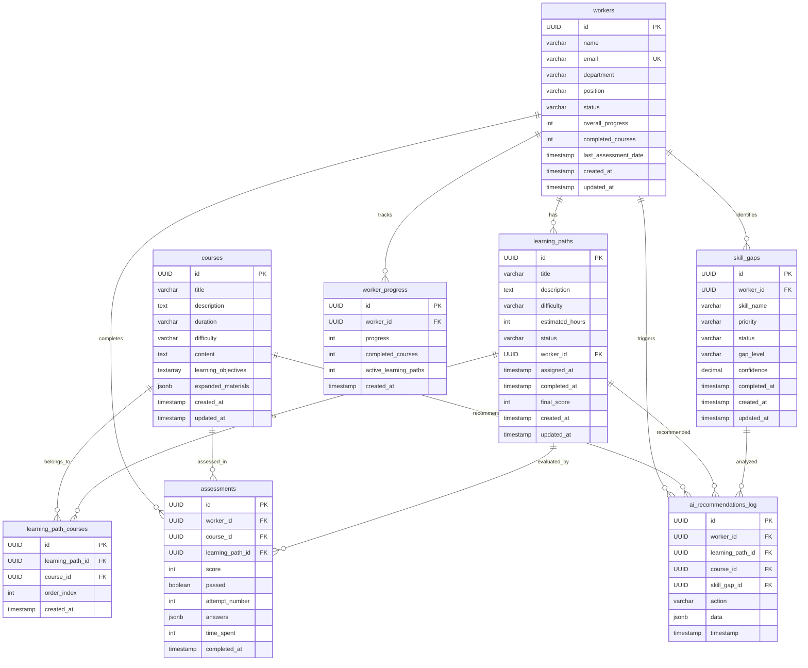

# LearnerAI Database ERD (Mermaid)

This file contains the complete Entity Relationship Diagram in Mermaid format for easy visualization.

## Complete ERD Diagram

## Relationship Legend

### Symbols Used
- `||--o{` = One-to-Many (0 or more)
- `||--||` = One-to-One
- `}o--o{` = Many-to-Many

### Relationship Types

#### One-to-Many Relationships (with CASCADE DELETE)

1. **WORKERS (1) to LEARNING_PATHS (many)**
   - Foreign Key: `learning_paths.worker_id`
   - Cascade: ON DELETE CASCADE
   - Purpose: Each worker can have multiple learning paths

2. **WORKERS (1) to SKILL_GAPS (many)**
   - Foreign Key: `skill_gaps.worker_id`
   - Cascade: ON DELETE CASCADE
   - Purpose: Each worker can have multiple skill gaps

3. **WORKERS (1) to ASSESSMENTS (many)**
   - Foreign Key: `assessments.worker_id`
   - Cascade: ON DELETE CASCADE
   - Purpose: Each worker completes multiple assessments

4. **WORKERS (1) to WORKER_PROGRESS (many)**
   - Foreign Key: `worker_progress.worker_id`
   - Cascade: ON DELETE CASCADE
   - Purpose: Historical progress tracking

5. **WORKERS (1) to AI_RECOMMENDATIONS_LOG (many)**
   - Foreign Key: `ai_recommendations_log.worker_id`
   - Cascade: ON DELETE CASCADE
   - Purpose: AI system activity logging

6. **LEARNING_PATHS (1) to LEARNING_PATH_COURSES (many)**
   - Foreign Key: `learning_path_courses.learning_path_id`
   - Cascade: ON DELETE CASCADE
   - Purpose: Path contains multiple courses

7. **LEARNING_PATHS (1) to ASSESSMENTS (many)**
   - Foreign Key: `assessments.learning_path_id`
   - Cascade: ON DELETE CASCADE
   - Purpose: Assessments linked to learning paths

8. **LEARNING_PATHS (1) to AI_RECOMMENDATIONS_LOG (many)**
   - Foreign Key: `ai_recommendations_log.learning_path_id`
   - Cascade: ON DELETE CASCADE
   - Purpose: Track AI recommendations for paths

9. **COURSES (1) to LEARNING_PATH_COURSES (many)**
   - Foreign Key: `learning_path_courses.course_id`
   - Cascade: ON DELETE CASCADE
   - Purpose: Course can belong to multiple paths

10. **COURSES (1) to ASSESSMENTS (many)**
    - Foreign Key: `assessments.course_id`
    - Cascade: ON DELETE CASCADE
    - Purpose: Multiple assessments per course

11. **COURSES (1) to AI_RECOMMENDATIONS_LOG (many)**
    - Foreign Key: `ai_recommendations_log.course_id`
    - Cascade: ON DELETE CASCADE
    - Purpose: Track AI recommendations for courses

12. **SKILL_GAPS (1) to AI_RECOMMENDATIONS_LOG (many)**
    - Foreign Key: `ai_recommendations_log.skill_gap_id`
    - Cascade: ON DELETE CASCADE
    - Purpose: Track AI analysis of skill gaps

#### Many-to-Many Relationship

**LEARNING_PATHS ⟷ COURSES (via LEARNING_PATH_COURSES)**
- Junction Table: `learning_path_courses`
- Purpose: Courses can belong to multiple learning paths, and paths contain multiple courses
- Ordering: Maintained via `order_index` field
- Uniqueness: UNIQUE constraint on (learning_path_id, course_id)

## Cardinality Summary

| Relationship | Cardinality | Via Field |
|--------------|-------------|-----------|
| workers → learning_paths | 1 : 0..* | worker_id |
| workers → skill_gaps | 1 : 0..* | worker_id |
| workers → assessments | 1 : 0..* | worker_id |
| workers → worker_progress | 1 : 0..* | worker_id |
| workers → ai_recommendations_log | 1 : 0..* | worker_id |
| learning_paths ↔ courses | M : M | learning_path_courses |
| learning_paths → assessments | 1 : 0..* | learning_path_id |
| courses → assessments | 1 : 0..* | course_id |

## Key Business Rules

### Status Values
- `workers.status`: 'active', 'inactive', 'pending'
- `learning_paths.status`: 'draft', 'active', 'completed', 'archived'
- `skill_gaps.status`: 'pending', 'in-progress', 'completed', 'failed'

### Difficulty Levels
- `learning_paths.difficulty`: 'beginner', 'intermediate', 'advanced'
- `courses.difficulty`: 'beginner', 'intermediate', 'advanced'
- `skill_gaps.gap_level`: 'beginner', 'intermediate', 'advanced'

### Priorities
- `skill_gaps.priority`: 'low', 'medium', 'high'

### Value Ranges
- `overall_progress`: 0 to 100
- `score`: 0 to 100
- `confidence`: 0.00 to 1.00
- `attempt_number`: >= 1

## Viewing the Diagram

### Using Mermaid Live Editor
1. Copy the mermaid code from above
2. Go to https://mermaid.live/
3. Paste the code
4. View the interactive diagram

### Using GitHub
- This file will automatically render the diagram on GitHub
- Perfect for documentation and collaboration

### Using VS Code
1. Install "Markdown Preview Mermaid Support" extension
2. Open this file
3. Use Markdown preview to see the diagram

## Documentation Files

- **DATABASE_SCHEMA_DOCUMENTATION.md** - Complete detailed documentation
- **VISUAL_ERD.txt** - ASCII art ERD diagram
- **SCHEMA_ANALYSIS_SUMMARY.md** - Quick reference summary
- **ERD_MERMAID.md** - This file (Mermaid diagram)

---

*Generated from comprehensive schema analysis of LearnerAI database*
