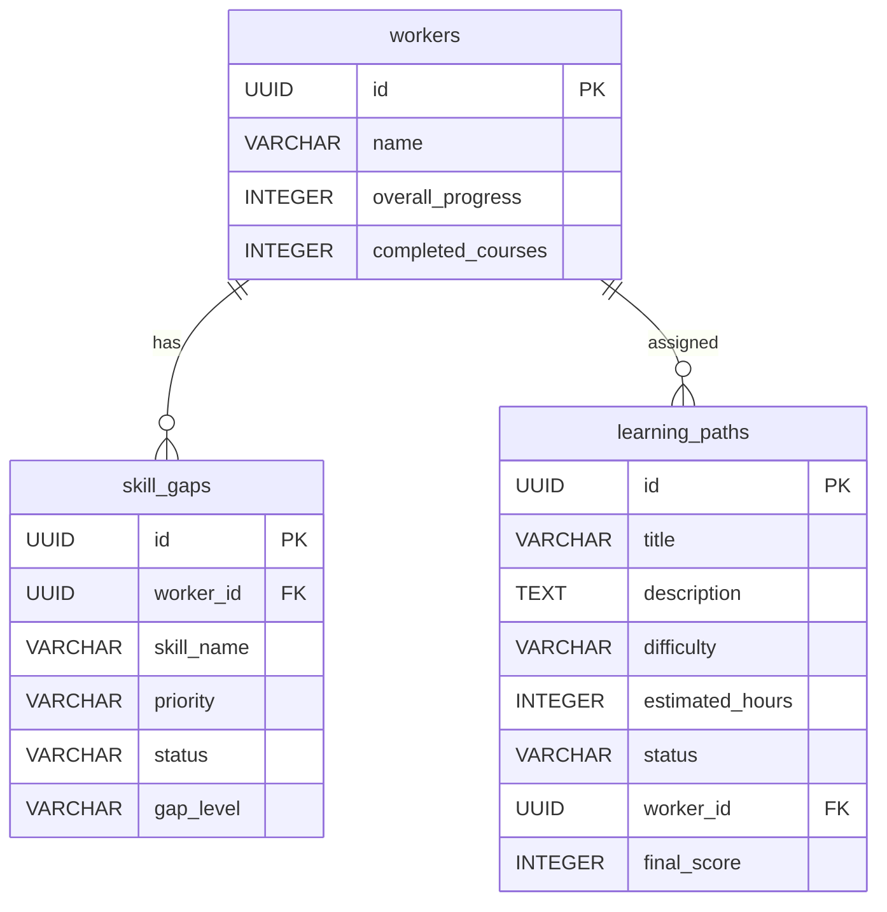

# Simplified Database Schema - Core Entities

## Focus: Learners, Skill Gaps, and Learning Paths

This document focuses on the three core entities: **Workers (Learners)**, **Skill Gaps**, and **Learning Paths**.

---

## Core Entity: **workers** (Learners)

**Purpose**: Stores learner profiles with minimal information

### Fields
| Field | Type | Purpose |
|-------|------|---------|
| `id` | UUID | **Primary Key** - Unique learner identifier |
| `name` | VARCHAR(100) | Learner's name |
| `overall_progress` | INTEGER | Overall learning progress (0-100) |
| `completed_courses` | INTEGER | Number of completed courses |

**Note**: Email, department, position, and other fields are excluded from this simplified view.

---

## Core Entity: **skill_gaps**

**Purpose**: Identified learning needs for each learner

### Fields
| Field | Type | Purpose |
|-------|------|---------|
| `id` | UUID | **Primary Key** |
| `worker_id` | UUID | **Foreign Key** → workers(id) |
| `skill_name` | VARCHAR(100) | Name of the skill gap |
| `priority` | VARCHAR(20) | Priority: low/medium/high |
| `status` | VARCHAR(20) | Status: pending/in-progress/completed/failed |
| `gap_level` | VARCHAR(20) | Level: beginner/intermediate/advanced |

### Relationship
- **Many Skill Gaps** belong to **One Learner** (worker_id FK)

---

## Core Entity: **learning_paths**

**Purpose**: Personalized learning sequences for learners

### Fields
| Field | Type | Purpose |
|-------|------|---------|
| `id` | UUID | **Primary Key** |
| `title` | VARCHAR(200) | Learning path title |
| `description` | TEXT | Learning path description |
| `difficulty` | VARCHAR(20) | Difficulty: beginner/intermediate/advanced |
| `estimated_hours` | INTEGER | Estimated completion hours |
| `status` | VARCHAR(20) | Status: draft/active/completed/archived |
| `worker_id` | UUID | **Foreign Key** → workers(id) |
| `final_score` | INTEGER | Final completion score (0-100) |

### Relationship
- **Many Learning Paths** belong to **One Learner** (worker_id FK)

---

## Simplified ERD



---

## Relationship Summary

### One Learner has Many Skill Gaps
```
WORKERS (1) ────► SKILL_GAPS (many)
           via worker_id (FK)
```

### One Learner has Many Learning Paths
```
WORKERS (1) ────► LEARNING_PATHS (many)
           via worker_id (FK)
```

---

## Example Data Structure

### Learner (Worker)
```json
{
  "id": "worker-001",
  "name": "Alex Johnson",
  "overall_progress": 75,
  "completed_courses": 3
}
```

### Skill Gap
```json
{
  "id": "sg-001",
  "worker_id": "worker-001",
  "skill_name": "Advanced JavaScript",
  "priority": "high",
  "status": "pending",
  "gap_level": "intermediate"
}
```

### Learning Path
```json
{
  "id": "lp-001",
  "title": "JavaScript Mastery Path",
  "description": "Complete learning journey to master JavaScript",
  "difficulty": "intermediate",
  "estimated_hours": 40,
  "status": "active",
  "worker_id": "worker-001",
  "final_score": 85
}
```

---

## Query Examples

### Get learner with skill gaps and learning paths
```sql
SELECT 
  w.id,
  w.name,
  w.overall_progress,
  w.completed_courses,
  (SELECT json_agg(sg.*) 
   FROM skill_gaps sg 
   WHERE sg.worker_id = w.id) as skill_gaps,
  (SELECT json_agg(lp.*) 
   FROM learning_paths lp 
   WHERE lp.worker_id = w.id) as learning_paths
FROM workers w
WHERE w.id = 'worker-001';
```

### Get only active learning paths for a learner
```sql
SELECT lp.*
FROM learning_paths lp
WHERE lp.worker_id = 'worker-001'
  AND lp.status = 'active';
```

### Get skill gaps by priority
```sql
SELECT sg.*
FROM skill_gaps sg
WHERE sg.worker_id = 'worker-001'
ORDER BY 
  CASE sg.priority
    WHEN 'high' THEN 1
    WHEN 'medium' THEN 2
    WHEN 'low' THEN 3
  END;
```

---

## API Endpoints (Simplified View)

### Get Learner with Skills and Paths
```javascript
GET /api/workers/:id

Response:
{
  id: "worker-001",
  name: "Alex Johnson",
  overall_progress: 75,
  completed_courses: 3,
  skill_gaps: [
    {
      id: "sg-001",
      skill_name: "Advanced JavaScript",
      priority: "high",
      status: "pending",
      gap_level: "intermediate"
    }
  ],
  learning_paths: [
    {
      id: "lp-001",
      title: "JavaScript Mastery Path",
      status: "active",
      estimated_hours: 40,
      difficulty: "intermediate"
    }
  ]
}
```

### Get Learning Paths
```javascript
GET /api/learning-paths

Query by worker (optional):
GET /api/learning-paths?workerId=worker-001

Response:
[
  {
    id: "lp-001",
    title: "JavaScript Mastery Path",
    status: "active",
    worker_id: "worker-001"
  }
]
```

### Get Skill Gaps
```javascript
GET /api/skill-gaps/:workerId

Response:
[
  {
    id: "sg-001",
    skill_name: "Advanced JavaScript",
    priority: "high",
    status: "pending",
    gap_level: "intermediate"
  }
]
```

---

## Data Flow

### Simplified Workflow
```
1. Learner Completes Assessment
   ↓
2. System Identifies Skill Gaps
   ↓
3. AI Generates Learning Path
   ↓
4. Learner Completes Learning Path
   ↓
5. Skill Gaps Marked as Completed
```

### Tables Involved
1. **workers** - Stores learner
2. **skill_gaps** - Stores identified gaps
3. **learning_paths** - Stores generated path
4. **ai_recommendations_log** - Tracks AI actions (background)

---

## Key Business Rules

### Skill Gap Priorities
- `high` - Urgent skill gap, address immediately
- `medium` - Important but not urgent
- `low` - Nice to have, low priority

### Learning Path Status
- `draft` - Being created, not yet assigned
- `active` - Currently in progress
- `completed` - Finished successfully
- `archived` - No longer active

### Gap Levels
- `beginner` - Fundamental skills needed
- `intermediate` - Mid-level competencies required
- `advanced` - Expert-level capabilities needed

---

## Simplified Indexes

### High-Performance Indexes
```sql
-- Index on worker status (for filtering active learners)
CREATE INDEX idx_workers_status ON workers(status);

-- Index on skill gaps by worker
CREATE INDEX idx_skill_gaps_worker_id ON skill_gaps(worker_id);

-- Index on learning paths by worker
CREATE INDEX idx_learning_paths_worker_id ON learning_paths(worker_id);

-- Index on learning path status
CREATE INDEX idx_learning_paths_status ON learning_paths(status);
```

---

## Summary

This simplified schema focuses on the core entities:

✅ **workers** (Learners) - Name + ID + Progress  
✅ **skill_gaps** - Learning needs identified  
✅ **learning_paths** - Personalized learning sequences  

**Relationship**: One learner has many skill gaps and many learning paths.

All three entities are connected via `worker_id` foreign key, ensuring data integrity and allowing for comprehensive learner tracking.
